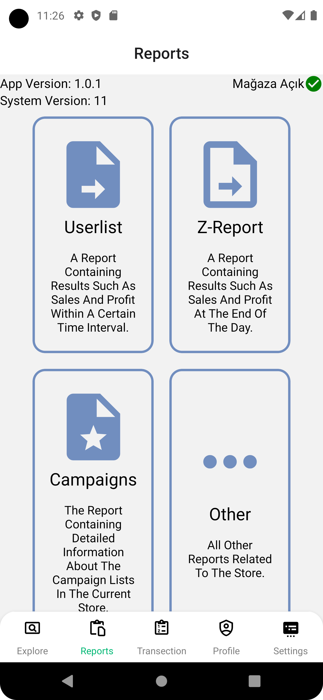
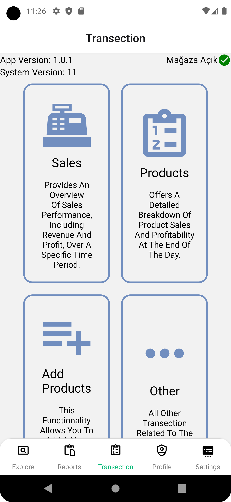
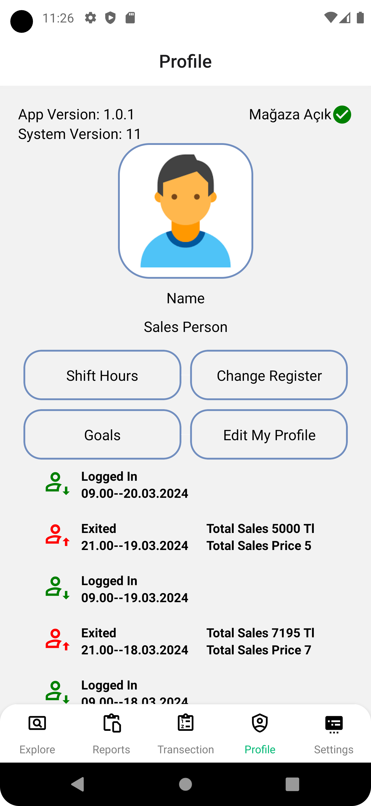
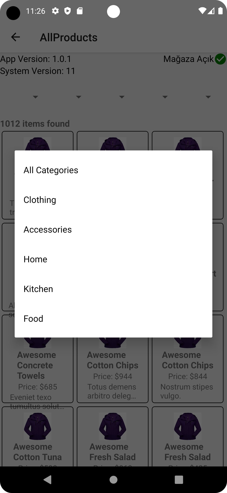
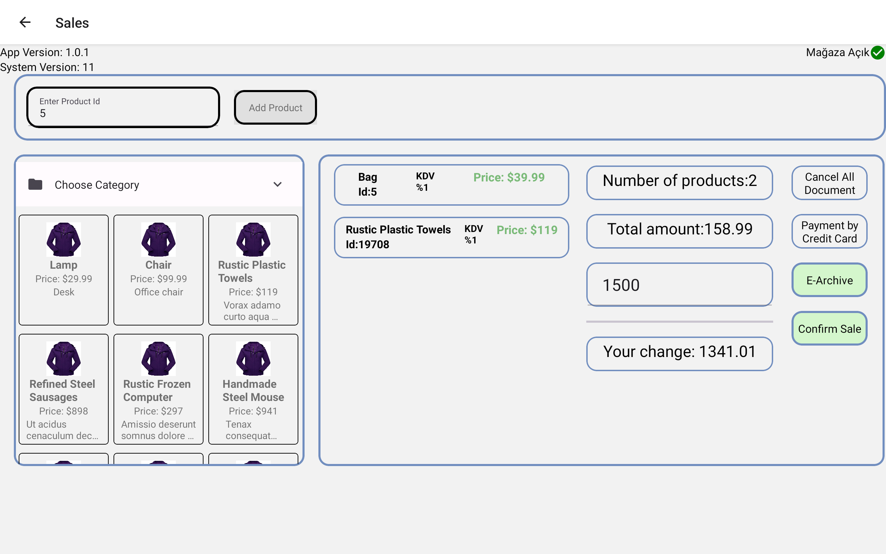
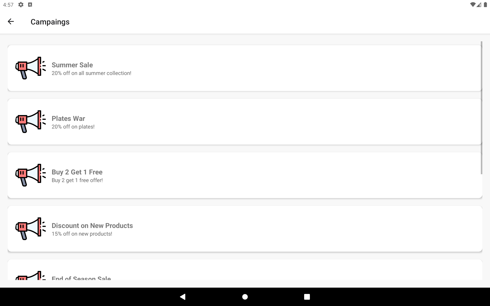
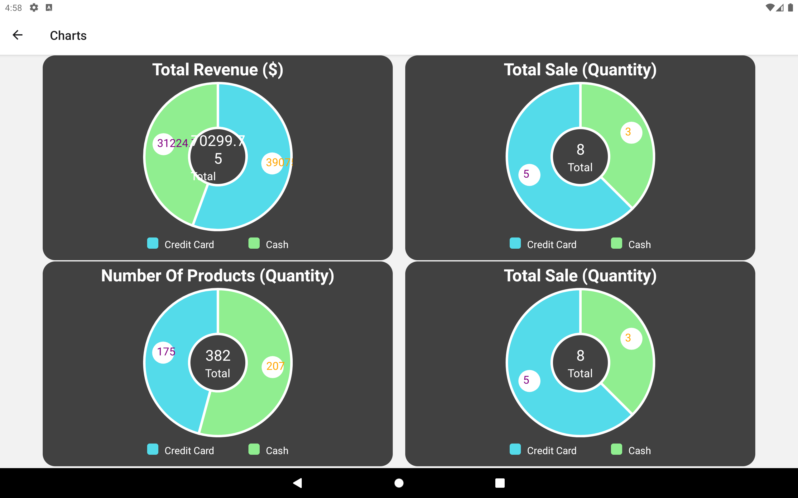
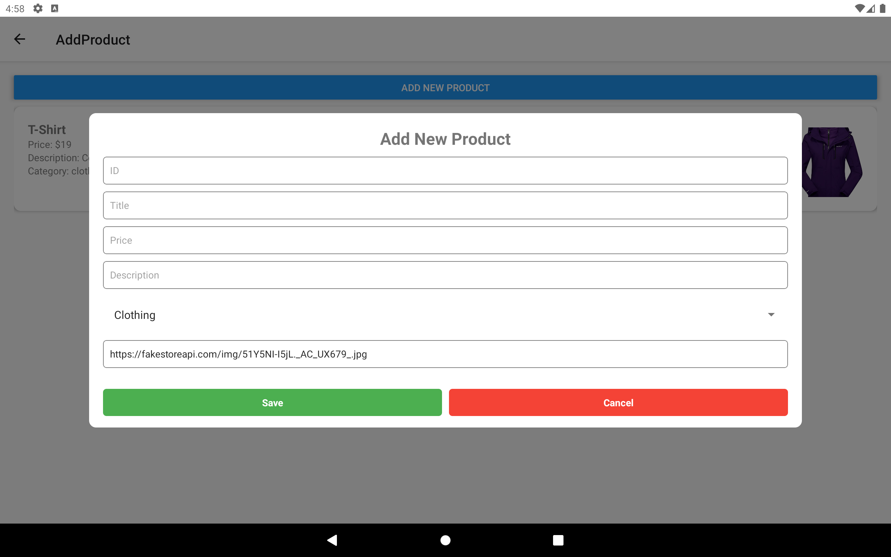

<div style="display: flex; justify-content: space-between; align-items: center; width: 100%;">
  
  
</div>


# Recipe-App

This project is based on the GitHub repository of the mobile cash register application carried out by Toyota and 32-Bit companies. Completed using the `React Native` framework version `"0.73.6"`.

## Getting Started

To run this project on your local machine, follow the steps below.

### Requirements

Make sure the following software is installed to run this project:

- **Node.js version: v20.11.0**  
  [https://nodejs.org/en](https://nodejs.org/en)
- **npm version: 10.7.0**  
  [https://www.npmjs.com/](https://www.npmjs.com/)
- **Android Studio, Webstorm, or related IDEs**  
  [https://www.jetbrains.com/webstorm/](https://www.jetbrains.com/webstorm/)  
  [https://developer.android.com/studio?hl=tr](https://developer.android.com/studio?hl=tr)
- **An emulator device**    
  [https://developer.android.com/studio?hl=tr](https://developer.android.com/studio/run/managing-avds?hl=tr)
- **Mockoon or related JSON services**  
  [https://mockoon.com/](https://mockoon.com/)

### Installation

1. **Clone the repository**:
   ```sh
   git clone https://github.com/phoenix9897/Recipe-App.git
   ```
2. **Navigate to the project directory**:
   ```sh
   cd Recipe-App
   ```
3. **Install the necessary dependencies**:
   ```sh
   npm install
   ```
4. **Start node package manager**:
   ```sh
   npm start
   ```
5. **Choose an emulator**:
   - i - run on `iOS`
   - a - run on `Android`
   - d - open `Dev Menu`
   - r - `reload app`

## Before Run

### JSON Data Usage

Do not forget I have used my own JSON data in my app on my local internet. You are free to use your own data. 

You can find under this file the JSON data that I have used in my project. 
‘C:\Users\90533\Desktop\Basic_Store-main\assets\json\demo.json’. This is the JSON file that you have open with Mockoon. First copy this json file and put any directory and open it with Mockoon.

Make sure that you change your `IP address variable`  if you are going to use local JSON services. Update the IP address in `C:\Users\Recipe-App\assets\is\myIP.js`. Do not forget that you should use your IPV4 Ip address.

You can learn your IPV4 adress from your terminal.Search `cmd` on your computer and run `ipconfig`, you will see `IPv4 Address. . . . . . . . . . . : 172.16.20.225` something like this and copy IP adress.

After that you have to update your JSON services port.On directory `C:\Users\Recipe-App\assets\js\api.js` you should specify your port number that you are using on the localhost side.


### E-mail Service
In order to use e-mail service,before starting the mail server in the directory `C:\Users\Recipe-App\server`, you need to obtain an App Password or related API key for SMTP. 

Update the `pass` field with your credentials.This is the website of how you can generate your app password using Gmail SMTP
[ https://support.google.com/accounts/answer/185833?hl=en]

```js
pass: '################'
```

Additionally, update the sender email address:

```js
user: 'oguzhanfatihk@gmail.com'
```

After you made those changes, you should start Node.js project in directory `C:\Users\Recipe-App\server\server.js`

Do not forget! I have chosen port `3002 to SMTP server`. You should be aware of that. You should check if this port is available or not.


## Permissions

As default, these permissions were  provided by project but you should check if your emulator that you are using is available for these permissions.

At `C:\Users\Recipe-App\android\app\src\main\AndroidManifest.xml`. You should give those permissions:

```sh
<manifest xmlns:android="http://schemas.android.com/apk/res/android">

    <uses-permission android:name="android.permission.INTERNET" />
    <uses-permission android:name="android.permission.NFC" />
    <uses-permission android:name="android.permission.VIBRATE" />
    <uses-permission android:name="android.permission.WRITE_EXTERNAL_STORAGE"/>
    <uses-permission android:name="android.permission.READ_EXTERNAL_STORAGE"/>
    .
    .
    .
</manifest>
```


## Usage Of App

### Login

User informations come from JSON data. There is test user that is `name:oguz` and `password:123456` you will be able to acces system.

### Products

In transection screen there is option that named `products` after clicking that, you will see some products. You can add your list by clicking any products. If you want to add more than one same products you should click and keep clicking (longpress) so there will be shown ad model that asks quantity of products that you want add.After those process products will be added on your list.

Also there is an option that will provide you to filtering and sorting products. By clicking `See All Products` you can see all products and you can filter or sort products as `Categories`, `Prices`, `Alphabetically` and soon.

Just in case you want the delete a product you can click long press any products on list and alert will be shown so that you can delete this products. On the other hand if you want to delete all products you can click `Cancel All Document`.


### Sale

After adding your products on your list you can reach sale screen clicking `Transection/Sales`. You will be able to see products on your list.

You can add products if you know ID of product by writing on `Enter Product Id` and click `Add Product` so products will shown the list.

Also you can add products quickly as categories on the left side.

After all those process you can increase and decrease the quantity of products on the list.

You can apply campaing after before sales process on the top-right at the screen.

### Sale Confirm

There is two option to finish sale process; cash and credit card. If you choose credit card you just click `Payment By Credit Card`. On the other side you can choose cash payment. You should write amount of cash you get on the `Cash Received` than click `Confirm Sale`. 

### E-mail

There is only cash option which provides e-mail services. After enter the amount of cash you get, `E-archive` option will be available and you can enter customer's e-mail and the recipe will be sent to the that e-mail.

### Add Product

This functionality is not available right now but there is just a demonstration.Follow this directory `Transection/Add Product` and click `Add New Products` after fill in the blank fields.


### Reports

This screen basically keep information and charts of app which you can reach `User Informations`, `Z-Report`,`Campaing` and `Charts`.

`User Information`: Keeps all user information registered in the system.

`Z-Report`: You can access the receipts of sales made during the day. The receipts are divided into two: those sent to the center and those not sent.
`Campaing`:Page where you can get detailed information about the campaigns registered in the system
`Charts`:This is the report page of sales made during the day. The number of sales, the income generated from them, and the total number of products sold by credit card and cash are presented in separate graphs.

### Explore Screen

This is the page where the features in the application are listed and can be searched manually. By clicking on the features, you will be directed to the page where the feature is located.

### Settings Screen

This page is the page where settings related to our application will be made. These settings include features such as sound, theme selection, language selection, logout, and also offer services such as security and about us. With manual synchronization, receipts that are not sent to the center are manually sent to the center.


## Provided Project Requirements

| Feature  | Applied  | Tested |
| :------------ |:---------------:| :-----:|
| Add Product                          |    ✓    |   ✓    |
| Adding Multiple Items to Cart         |    ✓    |   ✓    |
| Campaign List and Campaign Application|    ✓    |   ✓    |
| Choosing Products From Categories     |    ✓    |   ✓    |
| End of Day Reports                    |    ✓    |   ✓    |
| Explore Screen                        |    ✓    |   ✓    |
| Incorrect Login                       |    ✓    |   ✓    |
| Manual synchronization                |    ✓    |   ✓    |
| Multi Language                        |    ✓    |   ✓    |
| NfC Login                            |    ✓    |   ✓    |
| Other User Information Page           |    ✓    |   ✓    |
| Payment Process Cash-Credit Card      |    ✓    |   ✓    |
| Product Entry Via Barcode             |    ✓    |   ✓    |
| Product Sorting And Filtering         |    ✓    |   ✓    |
| Receipt Service By E-mail             |    ✓    |   ✓    |
| Reporting Past Sales                 |    ✓    |   ✓    |
| Responsive-Design                    |    ✓    |   ✓    |
| Row and Entire Document Canceled      |    ✓    |   ✓    |
| Staff-Register Information           |    ✓    |   ✓    |
| Store Status                         |    ✓    |   ✓    |
| Theme Selection                      |    ✓    |   ✓    |
| Version Information                  |    ✓    |   ✓    |
| View Shift Hours                     |    ✓    |   ✓    |
| Virtual Receipt Display - Save As PDF |    ✓    |   ✓    |

## Libraries Used In the Project

| Libraries                            | Module                               | Purpose                             |
|--------------------------------------|--------------------------------------|-------------------------------------|
| axios| axios| HTTP Requests, Fetching Data|
| expo-status-bar            | StatusBar  | User Interface Components                         |
| nodemailer            | nodemailer  | Sending Email                         |
| lottie-react-native| LottieView | Animations, UI Blocking|
| react| useContext, useState| State Management|
| react-i18next| useTranslation                       | Multilanguage                       |
| react-native|  View, Text, Image, TouchableOpacity, Modal, TextInput, Button, FlatList, SafeAreaView | User Interface Components                   |
| react-native                          | Alert, StyleSheet, Vibration, Platform, BackHandler, | Device Management                   |
| react-native-community/slider         | Slider                               |     User Interface Components                                |
| react-native-device-info              | DeviceInfo                           | Getting information of working devices |
| react-native-gifted-charts            | BarChart, PieChart                   | Data Visualization                  |
| react-native-html-to-pdf              | RNHTMLtoPDF                          | Save Receipts As PDF                |
| react-native-nfc-manager              | NfcManager, NfcTech                  | NFC Login                           |
| react-native-paper                    | Icon, Searchbar, Divider, TextInput, SegmentedButtons, Switch, Badge, List | User Interface Components                 |
| react-navigation/bottom-tabs          | createBottomTabNavigator             | Bottom Tab Navigation               |
| react-navigation/native-stack         | createNativeStackNavigator          | Navigation Stack                    |
| react-native-root-toast               | Toast                                | Toast Message                       |
| react-native-picker/picker            | Picker                               | User Interface Components                          |
| react-navigation/native            | NavigationContainer                               | Routes-Navigation                        |


## Screenshots
<div style="display: flex; flex-wrap: wrap;">
   
   
   
   
   
   
   
   
   
   
   
   
  
</div>

<div style="display: flex; flex-wrap: wrap;">
   
   
   
   
   
   
</div>

## Support

For support, send an e-mail to oguzhan.kucuk@ogr.sakarya.edu.tr.


### Lisans

[MIT](https://choosealicense.com/licenses/mit/)

