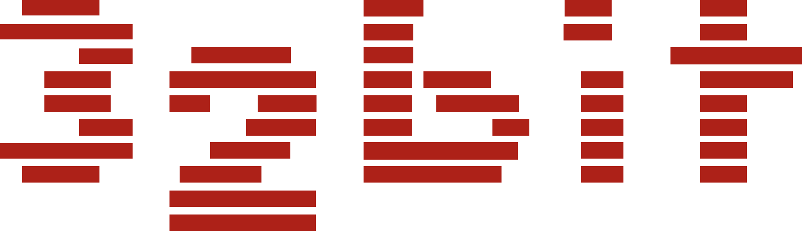
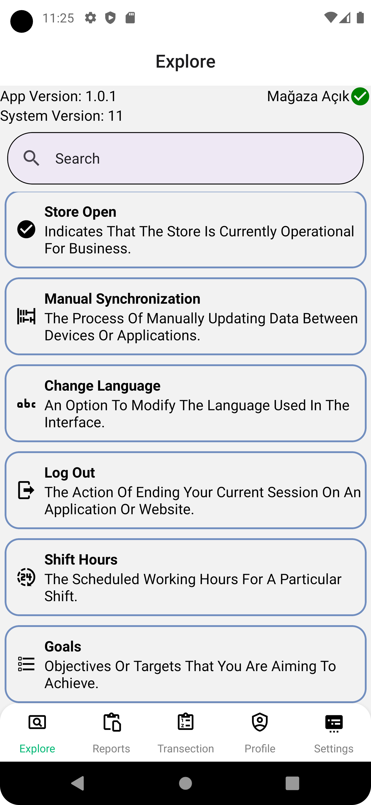
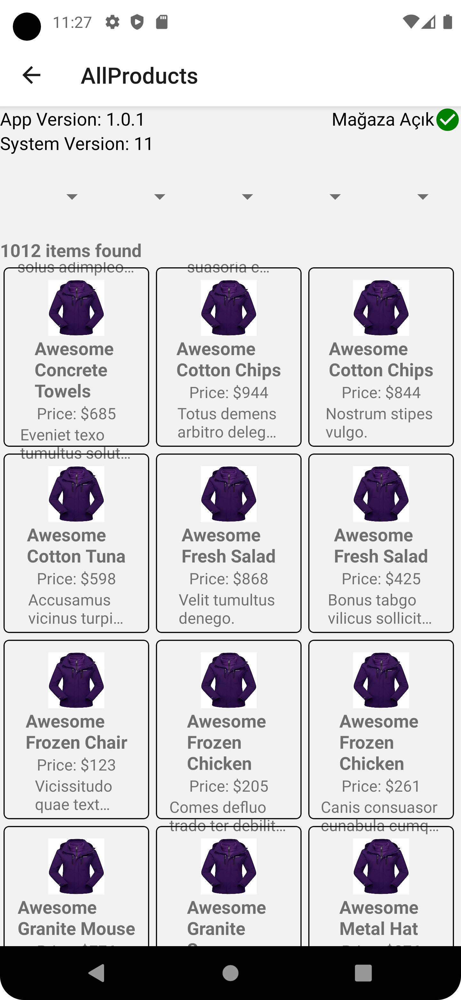

<div style="display: flex; justify-content: space-between; align-items: center; width: 100%;">
  
  
</div>


# Recipe-App

This project is based on the GitHub repository of the mobile cash register application carried out by Toyota and 32-Bit companies. Completed using the `React Native` framework version `"0.73.6"`.

## Getting Started

To run this project on your local machine, follow the steps below.

### Requirements

Make sure the following software is installed to run this project:

- **Node.js version: v20.11.0**  
  [https://nodejs.org/en](https://nodejs.org/en)
- **npm version: 10.7.0**  
  [https://www.npmjs.com/](https://www.npmjs.com/)
- **Android Studio, Webstorm, or related IDEs**  
  [https://www.jetbrains.com/webstorm/](https://www.jetbrains.com/webstorm/)  
  [https://developer.android.com/studio?hl=tr](https://developer.android.com/studio?hl=tr)
- **An emulator device**    
  [https://developer.android.com/studio?hl=tr](https://developer.android.com/studio/run/managing-avds?hl=tr)
- **Mockoon or related JSON services**  
  [https://mockoon.com/](https://mockoon.com/)

### Installation

1. **Clone the repository**:
   ```sh
   git clone https://github.com/phoenix9897/Recipe-App.git
   ```
2. **Navigate to the project directory**:
   ```sh
   cd Recipe-App
   ```
3. **Install the necessary dependencies**:
   ```sh
   npm install
   ```
4. **Start node package manager**:
   ```sh
   npm start
   ```
5. **Choose an emulator**:
   - i - run on `iOS`
   - a - run on `Android`
   - d - open `Dev Menu`
   - r - `reload app`

### Before Run

Do not forget I have used my own JSON data in my app on my local internet. You are free to use your own data. 

You can find under this file the JSON data that I have used in my project. 
‘C:\Users\90533\Desktop\Basic_Store-main\assets\json\demo.json’. This is the JSON file that you have open with Mockoon. First copy this json file and put any directory and open it with Mockoon.

Make sure that you change your `IP address variable`  if you are going to use local JSON services. Update the IP address in `C:\Users\Recipe-App\assets\is\myIP.js`. Do not forget that you should use your IPV4 Ip address.

After that you have to update your JSON services port.On directory `C:\Users\Recipe-App\assets\js\api.js` you should specify your port number that you are using on the localhost side.

Before starting the mail server in the directory `C:\Users\Recipe-App\server`, you need to obtain an App Password or related API key for SMTP. 

Update the `pass` field with your credentials.This is the website of how you can generate your app password using Gmail SMTP
[ https://support.google.com/accounts/answer/185833?hl=en]

```js
pass: '################'
```

Additionally, update the sender email address:

```js
user: 'oguzhanfatihk@gmail.com'
```

After you made those changes, you should start Node.js project in directory `C:\Users\Recipe-App\server\server.js`

Do not forget! I have chosen port `3002 to SMTP server`. You should be aware of that. You should check if this port is available or not.


### Permissions

As default, these permissions were  provided by project but you should check if your emulator that you are using is available for these permissions.

At `C:\Users\Recipe-App\android\app\src\main\AndroidManifest.xml`. You should give those permissions:

```sh
<manifest xmlns:android="http://schemas.android.com/apk/res/android">

    <uses-permission android:name="android.permission.INTERNET" />
    <uses-permission android:name="android.permission.NFC" />
    <uses-permission android:name="android.permission.VIBRATE" />
    <uses-permission android:name="android.permission.WRITE_EXTERNAL_STORAGE"/>
    <uses-permission android:name="android.permission.READ_EXTERNAL_STORAGE"/>
    .
    .
    .
</manifest>
```


### Provided Project Requirements

| Feature  | Applied  | Tested |
| :------------ |:---------------:| :-----:|
| NfC Login      | ✓  | ✓ |  
| Incorrect Login      |     ✓   |   ✓ |
| Version Information |     ✓   |    ✓ |
| Store Status |     ✓   |   ✓  |
| Product Entry Via Barcode |    ✓    |  ✓   |
| Choosing Products From Categories |    ✓    |  ✓   |
| Product Sorting And Filtering |    ✓    |   ✓  |
| Payment Process Cash-Credit Card  |   ✓     |  ✓   |
| Receipt Service By E-mail |   ✓     |   ✓  |
| Virtual Receipt Display - Save As PDF |    ✓    |    ✓ |
| Theme Selection |   ✓     |  ✓   |
| Multi Language |    ✓    |    ✓ |
| Reporting Past Sales |   ✓     |    ✓ |
| Manual synchronization |     ✓   |  ✓   |
| Explore Screen |    ✓    |   ✓  |
| Staff-Register Information |    ✓    |   ✓  |
| Responsive-Design |    ✓    |   ✓  |


### Screenshots
<div style="display: flex; flex-wrap: wrap;">
   
   
   
   
   
   
   
   
   
   
   
   
  
</div>

<div style="display: flex; flex-wrap: wrap;">
   
   
</div>

### Support

For support, send an e-mail to oguzhan.kucuk@ogr.sakarya.edu.tr.


### Lisans

[MIT](https://choosealicense.com/licenses/mit/)

